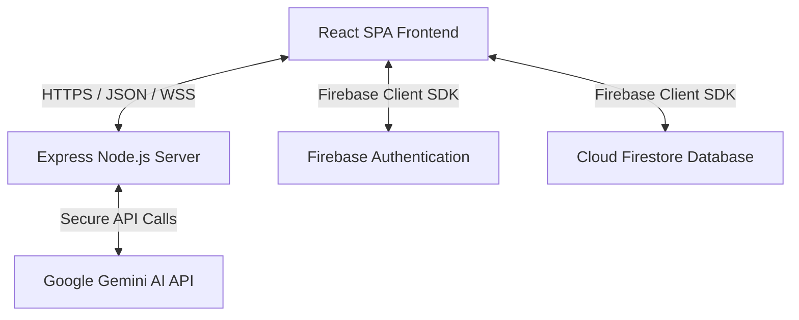

# Teknik Mimari Dokümanı (Technical Architecture)

Bu belgede, MadameSoul uygulamasının istemci (frontend) ve sunucu (backend) mimarisi, veri akışları, güvenlik katmanları ve bileşenlerin etkileşimi detaylandırılmıştır.

---

## 1. Genel Mimari Yapı (High-Level Architecture)

MadameSoul, **tek parçalı (monolith)** bir mimariye sahiptir. Sistem, istemci tarafı (Single Page Application - SPA) ve sunucu tarafı (API & Proxy) olmak üzere iki ana katmandan oluşur.

- **İstemci (React SPA):** Kullanıcı arayüzünü sunar, yerel durum yönetimini kontrol eder ve Firebase Client SDK ile doğrudan kimlik doğrulama ile veritabanı işlemlerini gerçekleştirir.
- **Sunucu (Express Node.js):** Geliştirme modunda Vite'ı bir middleware olarak çalıştırır, üretim modunda statik dosyaları sunar ve Gemini API anahtarını güvenli tutmak için bir API Proxy görevi görür.

---

## 2. İstemci Mimarisi (Frontend Architecture)

İstemci mimarisi, modern web standartları ve mistik bir kullanıcı deneyimi göz önünde bulundurularak React 19 ve TypeScript kullanılarak yapılandırılmıştır.

### 2.1 Durum Yönetimi (State Management)
Uygulama genelinde karmaşık global durum yöneticileri (Redux vb.) yerine, uygulamanın monolith yapısına uygun olarak **React Context** ve `App.tsx` bileşeni seviyesinde **in-memory states** tercih edilmiştir:
- **`user` ve `userInfo` Durumları:** Kullanıcının aktif oturum bilgisi Firebase Auth dinleyicisi (`onAuthStateChanged`) ile anlık izlenir ve Firestore `users` koleksiyonundan profil detayları çekilerek güncel tutulur.
- **`moonsCount` (Bakiye):** Firestore'daki `user_moons` belgesi gerçek zamanlı olarak dinlenir, bakiye değişiklikleri anında arayüze yansıtılır.
- **`view` (Görünüm Yönlendirmesi):** Basit ve hızlı bir sayfa yönlendirmesi için `'landing' | 'select' | 'reading' | 'history' | 'profile'` durumları üzerinden görünüm kontrolü sağlanır.

### 2.2 Yerelleştirme (Localization - i18n)
Uygulama 6 dili destekler: Türkçe (`tr`), İngilizce (`en`), İspanyolca (`es`), Fransızca (`fr`), Korece (`ko`), Çince (`zh`).
- Dil dosyaları `src/locales/` klasörü altında **YAML** formatında saklanır.
- Tarayıcı dili otomatik olarak algılanır, kullanıcı dilerse manuel olarak değiştirebilir. Dil değiştiğinde YAML içeriği dinamik olarak yüklenir ve arayüz güncellenir.

### 2.3 PDF Üretim ve İndirme
Kullanıcılar tarot yorumlarını yerel cihazlarına indirebilirler:
- `html2canvas` kütüphanesi ile tarot okuma ekranının anlık görüntüsü (DOM ekran görüntüsü) yakalanır.
- `jsPDF` aracılığıyla bu görsel içerik bir PDF belgesi haline getirilerek kullanıcının cihazına indirilir. Bu işlem tamamen istemci tarafında gerçekleştiği için sunucuya ek yük bindirmez.

---

## 3. Sunucu Mimarisi (Backend Architecture)

Express 4 tabanlı sunucu, uygulamanın çalıştırılması ve harici servislerle güvenli entegrasyonu için kritik rol oynar.

### 3.1 Gemini API Proxy
En kritik sunucu görevi, Google Gemini API anahtarının güvenliğini sağlamaktır. API anahtarı istemciye gönderilmez; bunun yerine istemci backend üzerindeki `/api/generate` uç noktasına istek atar.
- Sunucu, `@google/genai` resmi Node.js SDK'sını kullanır.
- İstekler `gemini-3-flash-preview` modeline yönlendirilir.
- Sunucu tarafında hata yönetimi yapılarak istemciye temiz hata mesajları döner.

### 3.2 Geliştirme ve Üretim Modları (Vite Integration)
- **Geliştirme (Development):** Sunucu, Vite'ın `createServer` API'sini kullanarak Vite'ı bir Express middleware olarak yükler. Bu sayede frontend için ek bir geliştirme sunucusuna gerek kalmaz ve HMR (Hot Module Replacement) sunucu üzerinden çalışır.
- **Üretim (Production):** Sunucu, `dist/` dizinindeki derlenmiş statik dosyaları (`express.static`) sunar. Tüm tanımlanmayan rotalar (`*`) istemci tarafındaki yönlendirmenin çalışabilmesi için `index.html` dosyasına yönlendirilir.

---

## 4. Veri ve Güvenlik Mimarisi (Data & Security)

### 4.1 Cloud Firestore Veri Modeli
Firestore üzerinde 5 temel koleksiyon bulunur:
1. **`users`:** Kullanıcının temel profili ve yasal onay durumu.
2. **`user_moons`:** Kullanıcı bakiyeleri.
3. **`moon_transactions`:** Okumalar (kart seçimleri ve Gemini yorumları dahil) ve bakiye hareketleri.
4. **`phones`:** SMS pazarlama ve telefon kayıtları.
5. **`messages_{lang}`:** Dile özgü iletişim formu mesajları.

### 4.2 Güvenlik Kuralları (`firestore.rules`)
Veritabanı güvenliği, Firestore Security Rules aracılığıyla sunucu tarafında sıkı bir şekilde denetlenir:
- **Kullanıcı Verileri:** Bir kullanıcı yalnızca kendi `userId`'si ile eşleşen `users` ve `user_moons` belgelerini okuyabilir veya güncelleyebilir.
- **İşlemler (Transactions):** Kullanıcılar yalnızca kendi `userId`'lerine ait `moon_transactions` belgelerini okuyabilir ve oluşturabilir. `amount` ve `type` alanları gibi kritik alanlar kurallarda sıkı doğrulamalardan geçer.
- **Destek Mesajları:** Herhangi bir misafir kullanıcı `messages_{lang}` koleksiyonlarına yazma yetkisine sahiptir, ancak hiçbir kullanıcının bu mesajları okuma veya silme yetkisi yoktur (`allow read, update, delete: if false`).

### 4.3 Kimlik Doğrulama (Authentication)
Firebase Authentication üzerinden çoklu giriş yöntemleri desteklenir:
- **OAuth Sağlayıcıları:** Google Pop-up ve Apple Sign-In.
- **Klasik Yöntem:** E-posta ve şifre ile giriş.
- **SMS Kimlik Doğrulama:** ReCAPTCHA Verifier ile telefon numarası doğrulama ve SMS kodu ile giriş.

---

## 5. Paketleme ve Dağıtım Yapısı (Build & Deployment)

Uygulamanın paketlenme adımları Vite ve esbuild entegrasyonu ile otomatikleştirilmiştir.

- **Frontend Paketleme:** Vite kullanılarak frontend kodları küçültülür, optimize edilir ve `dist/` klasörüne statik varlıklar olarak çıkarılır.
- **Backend Paketleme:** `server.ts` dosyası ve bağımlılıkları `esbuild` aracılığıyla derlenerek tek bir CommonJS dosyası olan `dist/server.cjs` haline getirilir.
- **Çalıştırma:** Üretim ortamında sadece `node dist/server.cjs` komutunu çalıştırmak yeterlidir. Bu dosya hem API isteklerini karşılar hem de `dist/` altındaki frontend dosyalarını sunar.
