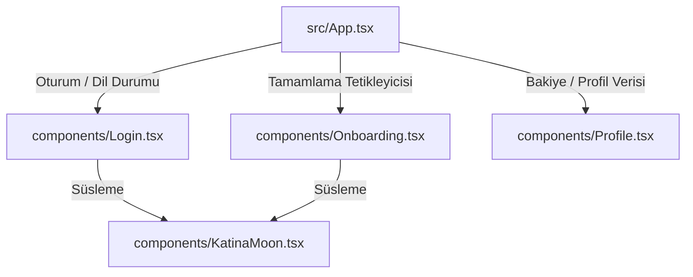

# Bileşen Envanteri (Component Inventory)

Bu belgede, MadameSoul React uygulamasını oluşturan temel kullanıcı arayüzü (UI) bileşenleri, bu bileşenlerin durumları (states), üstlendikleri görevler ve prop yapıları detaylandırılmıştır.

---

## 1. `App.tsx` (Ana Konteyner ve İş Akışı Yöneticisi)
Uygulamanın merkezidir. Yönlendirme (routing), kart seçme mantığı, durum yönetimi ve dış kütüphane entegrasyonlarının çoğunu barındırır.

- **Dosya Konumu:** `src/App.tsx`
- **Temel Görevleri:**
  - Kullanıcının tarayıcı dilini tespit edip uygun yerelleştirmeyi (i18n) yükleme.
  - Kart çekme ekranını yönetme (3 kart seçilmesi zorunluluğu).
  - Gemini API'sine tarot yorumu isteği atma.
  - Okunan tarot yorumunu PDF formatına dönüştürüp yerel cihazına indirme (`jspdf` ve `html2canvas` ile).
- **Yönettiği Durumlar (States):**
  - `user`: Aktif oturum açmış kullanıcı (Firebase Auth nesnesi).
  - `userInfo`: Firestore'dan çekilen kullanıcı profili (ad, doğum tarihi, doğum yeri vb.).
  - `moonsCount`: Kullanıcının sahip olduğu kredi bakiyesi.
  - `view`: Aktif görünüm (`'landing' | 'select' | 'reading' | 'history' | 'profile'`).
  - `selectedCards`: Kullanıcının seçtiği 3 Katina kartı.
  - `reading`: Gemini tarafından oluşturulan güncel tarot yorumu.

---

## 2. `Login.tsx` (Giriş ve Kayıt Bileşeni)
Kullanıcıların sisteme dahil olmasını sağlayan kapıdır. Birçok giriş metodunu ve yeni kayıt bonuslarını yönetir.

- **Dosya Konumu:** `src/components/Login.tsx`
- **Temel Görevleri:**
  - **Çoklu Giriş Yöntemleri:** E-posta/Şifre, Google ile Giriş, Apple ile Giriş ve Telefon SMS ile Giriş.
  - **Meta Veri Toplama:** Kayıt esnasında kullanıcının tarayıcı, işletim sistemi, IP adresi ve konum bilgilerini `lib/metadata.ts` üzerinden toplar ve Firestore'a yazar.
  - **Bakiyelendirme:** Yeni kayıt olan kullanıcılara hoş geldin bonusu (kredi) tanımlar.
  - **ReCAPTCHA Verifier:** Telefon doğrulaması için güvenlik kontrolünü üstlenir.

---

## 3. `Onboarding.tsx` (Tanıtım Sihirbazı)
Uygulama hakkında genel bilgilendirme yapan, görsel açıdan zengin slayt geçiş ekranıdır.

- **Dosya Konumu:** `src/components/Onboarding.tsx`
- **Temel Görevleri:**
  - Uygulamayı ilk kez açan kullanıcılara 3 adımdan oluşan (Welcome, Discovery, Journey) interaktif slaytlar sunar.
  - Animasyonlu slayt geçişleri ve arka planda hafif yavaş kayan mistik arka plan resimleri.
- **Kullandığı Teknolojiler:** `motion` (`AnimatePresence` ve `layoutId` özellikleri), `lucide-react`.

---

## 4. `Profile.tsx` (Profil ve Ayarlar Bileşeni)
Kullanıcının geçmişini gördüğü, profil bilgilerini ve hesap ayarlarını güncellediği kontrol panelidir.

- **Dosya Konumu:** `src/components/Profile.tsx`
- **Temel Görevleri:**
  - **Sekmeli Yapı:** 'Overview' (Genel Bakış) ve 'Settings' (Ayarlar) sekmeleri.
  - **Profil Güncelleme:** Ad, Doğum Tarihi, Doğum Yeri ve İlişki Durumu bilgilerini Firestore üzerinde günceller.
  - **Şifre Değiştirme:** E-posta kullanıcıları için güvenli şifre güncelleme mantığı.
  - **Geçmiş Okumaları Listeleme:** Firestore'daki `moon_transactions` koleksiyonundan son 10 okumayı çeker.
  - **PDF Tekrar İndirme:** Geçmiş bir okumanın detayına giderek yorum metnini PDF olarak indirme tetikleyicisi sağlar.

---

## 5. `KatinaMoon.tsx` (Animasyonlu Göksel Efekt Süslemesi)
Uygulamanın mistik ve premium havasını pekiştiren estetik bir görsel bileşendir.

- **Dosya Konumu:** `src/components/KatinaMoon.tsx`
- **Temel Görevleri:**
  - SVG tabanlı hilal şeklinde bir ay çizer.
  - Ayın etrafında hafif parıltı (glow) katmanı ve yavaşça dönüp boyut değiştiren yıldız parçacıkları oluşturur.
- **Kullandığı Teknolojiler:** `motion` yardımıyla `infinite` loop içeren scale, rotate ve opacity animasyonları.

---

## Bileşenler Arası Veri Akışı ve Entegrasyon

- **Durum Güncellemeleri:** Kullanıcı oturum açtığında `Login` bileşeni Firebase üzerinden tetiklenir, `App.tsx` içindeki `onAuthStateChanged` dinleyicisi bu durumu algılayarak ana görünümü günceller.
- **Veri Senkronizasyonu:** `Profile.tsx` içinde güncellenen profil detayları anında `App.tsx`'teki `userInfo` durumuna aktarılır ve veri tutarlılığı sağlanır.
